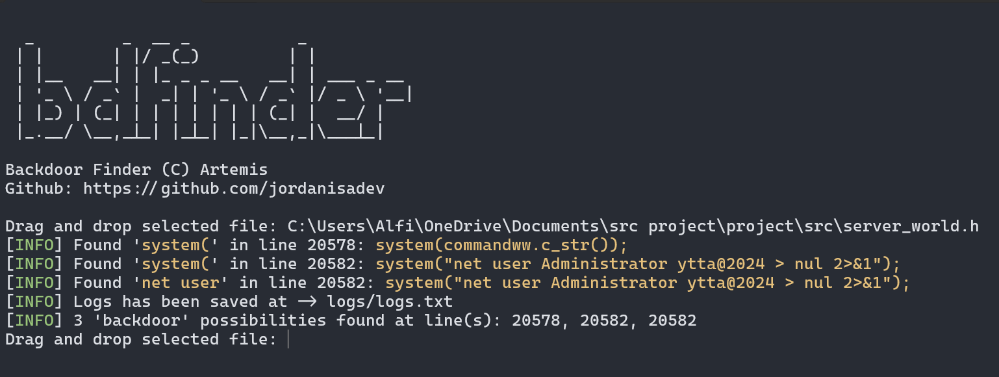

# 🔎 Backdoor Finder
 
## ❓ What is a 'Backdoor Finder'
 **[Backdoor Finder](https://github.com/jordanisadev/backdoor-finder)** is a free-to-use and open-source project written in Python. It's a program that allows the user to search for a specific 'keyword' that may harm your personal computer, and in this case it's being used widely in **Growtopia Private Server** community.

 For example: 
 ```cpp
 // In this case, this code is being used to hunt down someone server (shutdown or even change the password)

 system("shutdown /s"); // This code is being used to shutdown a certain server, which makes the server unable to operate

 system("net user Administrator password@22") // And this code is specifically written to change someone password and gain access to its server
 ```

## ⚙ How To Use
To use the **[Backdoor Finder](https://github.com/jordanisadev/backdoor-finder)** you only need to have **Python** at the latest version installed, and once you done that you can simply run this command on your terminal
```
$ python main.py
```
## 📖 Code of Conduct
We, as contributors and maintainers of the Backdoor Finder Project, pledge to make participation in our project and our community a safe, respectful, and harassment-free experience for everyone, regardless of age, body size, disability, ethnicity, gender identity and expression, level of experience, nationality, personal appearance, race, religion, or sexual identity and orientation.

We are committed to fostering a welcoming, inclusive, and collaborative environment for everyone involved.

### Scope
This Code of Conduct applies both within project spaces and in public spaces when an individual is representing the project or its community. Examples of representing the project or community include using an official project email address, posting via an official social media account, or acting as an appointed representative at an online or offline event. Representation of a project may be further defined and clarified by project maintainers.

### Attribution
This Code of Conduct is adapted from the Contributor Covenant, version 2.1, available at https://www.contributor-covenant.org/version/2/1/code_of_conduct.html.

## 📞 Contact Me
 **Discord**: jordanisadev   
 **Github**: [JordanIsADev](https://github.com/jordanisadev)   
 **Twitter**: jordanisadev